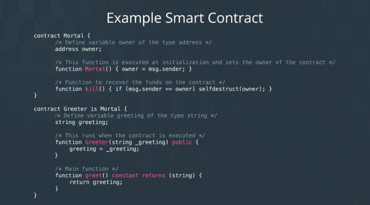
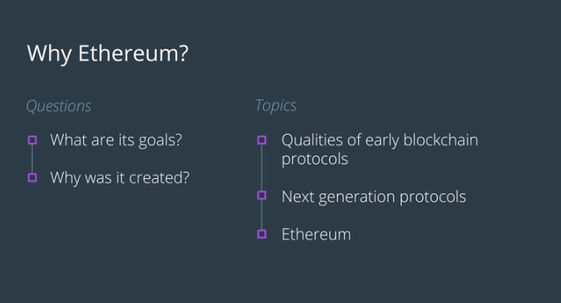

> Ethereum Smart Contracts, Tokens and Dapps  
Udacity Nanodegree // Blockchain Developer

# Lesson 1: Ethereum Fundamentals and Development Tools

## Ethereum Basics

[Blockchain Re-cap](https://youtu.be/B4bYtFQnTyM)

### Ethereum Basic Terminology

> Ethereum  
An open source, programmable public blockchain platform

Ethereum includes its own programming language known as solidity.

> Ethereum Virtual Machine (EVM)  
Capable of executing logic, algorithms, and processing data inputs

Where Bitcoin a user is given a set of pre-defined operations, in Ethereum a user can create their own set of operations.

> Turind Complete  
Any software that is ale to run code written by a developer or executed by an end user

Developers can use Ethereum's programming language, Solidity, to create applications and shares similarities to Python / JavaScript which executes on an EVM.

With the above, this will be used to create a **Smart Contract**.

> Smart Contract  
A contract written in code  
More specifically, it is an object on the Ethereum blockchain that contains EVM code functions

	

A smart contract can store data, make decisions, interact with other contracts and send Ether (Ethereum's currency)

Smart contracts will exist and be executable so long as the network exists, and they are owned by no one and cannot be taken down, unless programmed to self-destruct with a kill switch. **Implementing kill switches is good practice when working with smart contracts**

	

	

> Solidity  
High level language for coding and deploying smart contracts

It's creation was heaviliy influenced by C++, Python, and JavaScript.

**Features:**
* Statically Types
* Supports Inheritance
* Libraries
* Complex User Defined Types

Ethereum's major goal is to become a world computer. Aims to implement a digital computer that is decentralized globally, and executes peet-to-peer transactions and contracts.

The blockchain platform and public network together is termed as the general-purpose world computer.

	

## What Makes Ethereum Special?

Ethereum was built to improve existing blockchain platforms. Specifically, it's plans were first laid out in the [Ethereum yellowpaper](https://github.com/ethereum/yellowpaper). This was written by Vitalik Buterin, the founder of Ethereum. 

At the time he was the co-founder and leading writer at Bitcoin  Magazine. For that reason, there's a lot of intentional differences  meant specifically to solve the problems Vitalik saw with Bitcoin.  Throughout the next few videos, we'll describe how Ethereum set to  differentiate itself from other blockchain platforms.

### Why Ethereum?

	

Earlier blockchains were created to serve one single purpose, like Bitcoin did for currency.

The next set of blockchain protocols focused to be more flexible which allows them to adapt to a few applications instead of one. Allows the protocol to change based on the needs of their users, but the downside to this is that it becomes very complex to manage as the upgrades take a lot of work from developers.

	

Ethereum comes knocking, set out to solve problems it saw with the earlier protocols, create a generalized platform that allowed others to develop on top of it.

Allows us to use the same ideas we know about blockchains and extend them further without Ethereum having to update its protocol.

	

### Ethereum vs Bitcoin State

The way a blockchain manages its information within its data storage layer determins its state. How does the protocol handle transactions, keys, fees and other information.

In Bitcoin, UTXO's are what represent the state of the blockchain. Can sum the UTXO's to find the Bitcoins owned by a user, as an account balance isn't stored anywhere and instead is found by referring to the state of the blockchain.

Ethereum can manage more than unspent transaction outputs. Within its state you can find the following:

	

In Bitcoin all information stays on the blockchain, whereas in Ethereum, the account state is separate. It's removed from the blockchain but holds information about the state of the blockchain. 

The blockchain remains a ledger that contains the history of transactions. Other information including accounts, addresses and balances exists along with the state. The information is mapped to the blockchain allowing it to track things like the account balance of a user.

	

Storing the information in such a way is because of the Patricia tree which stands for **Practical Algorithm to Retrieve Information Coded in Alphanumeric**.
Allows Ethereum to store values in a way that expands the state to include the account values.

### Bitcoin vs Ethereum

Both have permissionless restrictions, allowing anyone to validate and create blocks on the network. Whereas in a permission system, nodes would need permission from a central authority to join the network.

Both use the Proof of Work consensus, but Ethereum is working on migrating to Proof of Stake via a project known as Casper.

Both have high node scalability and low performance scalability. Allowing any user to join the network for user scaling and rapid expansion but both platforms struggle with performance scaling. Bitcoin takes about 10 mins to settle a transaction and Ethereum 15 seconds. May look like a great improvement but if you look at Visa and MasterCard, they process about 5000 transactions per second.

Bitcoins regulation of the protocol is low, decentralized decision-making by community whereas Ethereum is medium, decisions made by core developer group.

Both are pseudoanonymous, meaning identities are tied to public keys. Transactions are anonymous but not 100%, as the transaction can be traced back to a user via their public key.

Both have their native currency, Bitcoin has Bitcoin while Ethereum has Ether.

Both allow for scripting but this is where Ethereum shines. Where Bitcoin is limited but Ethereum is turing complete.

	

### Ethereum Virtual Machine

Runs and powers the Ethereum platform, often called the Operating System of Ethereum. All nodes on the network run EVM, and all these connected nodes are referred to as the World Computer.

	

The Ethereum protocol was first implemented in Go, C++ and Python. Geth (Go Ethereum) will be used for implementation.

Allows to run a node to build and deploy smart contracts. Smart contracts are compiled into two views:

* **Bytecode View** which is machine readable
* **Assembly View** which is human readable

The compiled code then executes on the EVM, executing the logic of the program.

	

## Ethereum Tools and Community

### Ethereum Tooling Ecosystem

[**Etherscan**](https://etherscan.io/)
Block explorer used to search Ethereum analytics

[**Metamask**](https://metamask.io/)
Browser based plug-in that allows to carry out Ethereum transactions

[**Remix**](https://remix.ethereum.org/)
Browser based IDE that allows to write Solidity and deploy solidity contracts

[**web3.js**](https://web3js.readthedocs.io/en/1.0/)
Collection of libraries that allow to interact with a local or remote Ethereum node

[**Infura**](https://infura.io/)
Gives access to the Ethereum network without running your own local node

[**Ganache**](https://truffleframework.com/ganache)
Applcation for launching local Ethereum blockchain instances

[**Truffle**](https://truffleframework.com/)
Development environment, testing framework, and asset pipeline meant to make your life easier as an Ethereum developer

[**Geth**](https://geth.ethereum.org/)
Golang implementation of the Ethereum blockchain used to set up a local full Ethereum node

### Ethereum Communities

-   [Github](https://github.com/ethereum)
-   [YouTube](https://www.youtube.com/user/ethereumproject)
-   [Gitter](https://gitter.im/ethereum/home)
-   [Twitter](https://twitter.com/ethereum)
-   [Stack Exchange](https://ethereum.stackexchange.com/)
-   [Reddit](https://www.reddit.com/r/ethereum)
-   [Meetups](https://www.meetup.com/topics/ethereum/)

## Introduction to DApps

### Intro to DApps

A decentralized application (DApp) is an application that has its backend code running on a decentralized peer-to-peer network, whereas a standard application runs off a centralized network.

**Resources**
[DappRadar](https://dappradar.com/)
[State of the DApps](https://www.stateofthedapps.com/)