> Blockchain Developer
> Udacity Nanodegree

# Blockchain Fundamentals

## Lesson 1: Blockchain Basics

> Blockchain
> Shared database that contains a list of transactions

> Hash
> A unique fingerprint for information

### Blockchain Framework

<div align="center">
	
</div>

### Financial Transactions

#### Current State of Financial Transactions

Trading, by giving value to something, but makes it difficult to agree on its value.

Find something with intrinsic value like gold, where the value of an item can be agreed upon to how much gold it's worth. This could be further evolved by creating a currency like money in place of the gold.

Banks manage the transactions we are making with our money. These establishments are known as a **trusted 3rd party**.

> Trusted 3rd Party
> Entity that facilitates interactions between two parties

These establishments help in securely storing our money and managing our transactions. Many systems are in place to make this happen but a key one is a **ledger**

> Ledger
> List of transaction records

Keeping track of who paid whom and who has what, to help prevent **double spending**

> Double Spending
> When comeone spends the same money more than once

#### Problems

Banks having our transaction data is crucial, but is it ideal to have that much control of the data?

Let's remove the bank ledger and implement a shared ledger where everyone has access and have complete control over their own data.

---

Delayed transaction times and fees when transferring money through different services that need to communicate with the banks.

Blockchain could solve all this, but it's all a **WORK IN PROGRESS**

### Introduction to Bitcoin

#### What is Bitcoin?

Blockchain started with the first implementation of a new currency; **Bitcoin**

> Bitcoin
> A digital currency that utilizes the blockchain to facilitate financial transactions

Uses the idea of **blocks** to store and validate transactions.

> Block
> Groups of transactions bundled together

Bitcoin was not the first to group, validate and link documents. Starts around 1991, when Haber and Stornetta released their research paper [How to Time-Stamp a Digital Document](https://www.anf.es/pdf/Haber_Stornetta.pdf)

The research proposed to timestamp a document and linking it to the previous document to create a chain of validated documents.

In 2008, Satoshi Nakamoto, published a **whitepaper** detailing the foundation of Bitcoin; [Bitcoin: A Peer-to-Peer Electronic Cash System](https://bitcoin.org/bitcoin.pdf).

> Whitepaper
> A guide that informs readers concisely about a complex issue and presents understanding on an issue, solving problem or making a decision

January 3, 2009: Nakamoto released the Bitcoin software.

After Bitcoin came about was the realization of the potential in the blockchain.1

### Hashing

> Hash Value
> A digital fingerprint for information

A unique string of letters and numbers that represent a set of data, which can be generated through a **hashing function**

> Hashing Function
> Maps a group of data to a unique hash value

Hash value acts as a unique identifier for the original data. Allows to easily identify data by referencing its hash value.

<div align="center">
	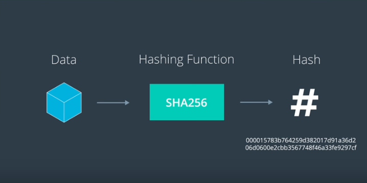
</div>

A unique value is given to each block on the blockchain to create a unique identifier for each block that exists in the chain.

Allows to reference a block by its hash value and create the foundation in how blocks are chained.

Tool: [Ander's | SHA256 Hash](https://andersbrownworth.com/blockchain/hash)
Exercise: [Practice Hashing](./exercises/hashing)

### Blocks

Fundamental componenets of the blockchain.

> Block
> A container that holds a list of transactions to be added to the blockchain

> Blockhain
> Shared digital ledger that records a list of transactions

#### Transactions

Without the blocks, which compartmentalize the transactions, it would create a massive list of transactions that would be difficult to work with or manage.

<div align="center">
	<p>Transaction list without blocks</p>
	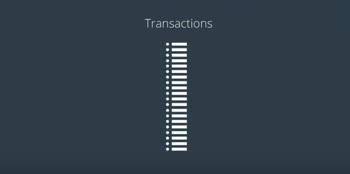
</div>

<div align="center">
	<p>Transaction list separated into blocks</p>
	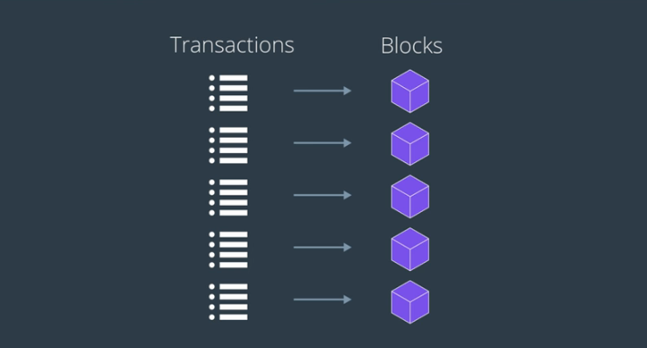
</div>

With the transactions broken out into blocks, it makes it easier to manage, with transactions held in the *body of a block*

#### Block Header

Additional information is stored in the block as well, this is at the _block header_ which details the structure of the data within

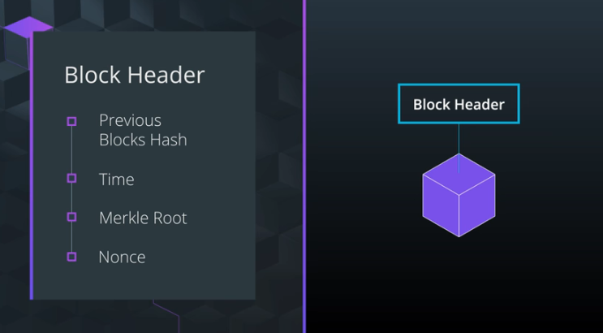

##### Previous Block's Hash
hash of the block before the current one. Allows the blocks to be linked together by knowing what came before / after

<div align="center">
	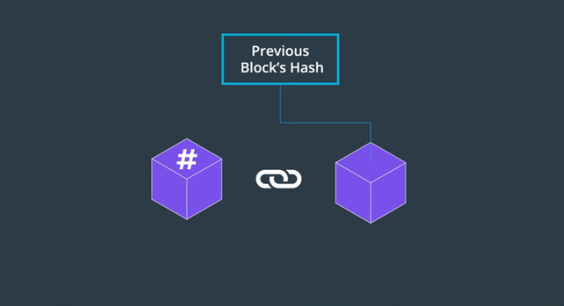
</div>

---

##### Time
when the block was created, which helps in avoidining double-spending and validates which block came first

<div align="center">
	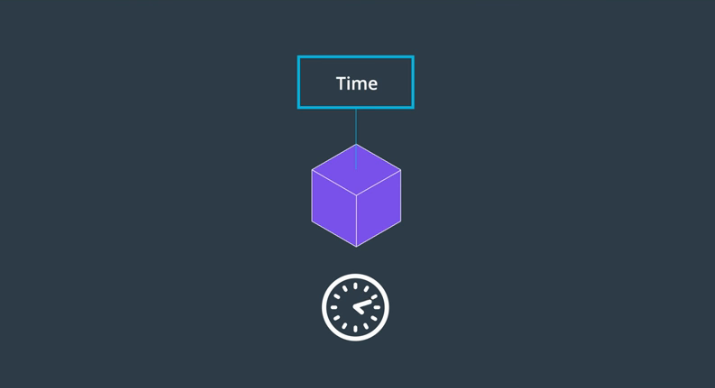
</div>

---

##### Merkle Root
hash that represents every transaction inside the block, which is derived from pairs of the transactions insde the block repeatedly hashed together.

Each pair results in a hash which is hashed repeatedly until a single hash value is generated.

<div align="center">
	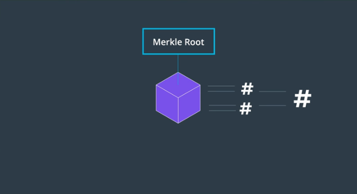
</div>

---

##### Nonce
related more towards mining. An arbitrary value that can only be used once. 

When a hash is created for a block, a very specific value is required that starts with a set number of zeros that determines the hash's difficulty to find.

Requiring all the block data and the nonce to get the hash value, which the computer does over and over until the appropriate hash is found.

<div align="center">
	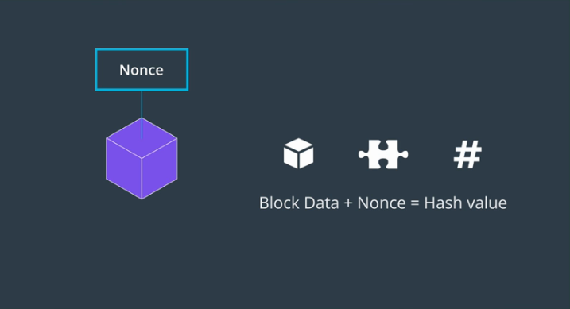
</div>

---

#### Block Difficulty

A block's difficulty is determined by the amound of zeros prepended to the hash More zeros increases the diffilculty while less does the reverse.

<div align="center">
	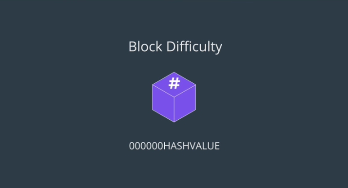
</div>

#### Block Size

This is the amount of data it takes to the block fill up before a new one needs to be created. Block size affects all the blocks in the blockchain and is determined by the developer, thus requiring an update to the software to change the block size value.

<div align="center">
	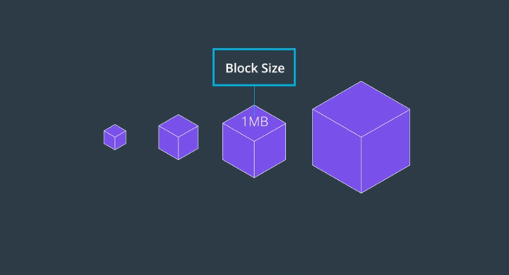
</div>

#### Block Hash

A unique digital fingerprint that is derived from the block's data being passed through a SHA256 algorithm. If any of the data changes within the block, a new hash would be derived, allowing to determine if the block's data was tampered.

<div align="center">
	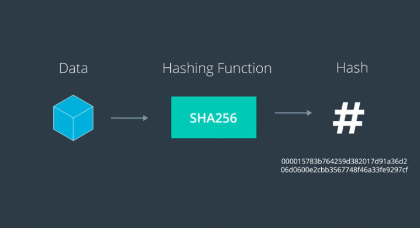
</div>

Tool: [Ander's | Block](https://andersbrownworth.com/blockchain/block)
Exercise: [Practice Block](./exercises/block)

### Blockchain

The place where data is stored; every other component is the system around the blockchain that makes it all work.

> Blockchain
> Digital ledger that contains the entire history of transactions made on the network

**All of the information on the blockchain is permanent and cannot be changed**

The blockchain is constructed of two main things, blocks and hash values.

<div align="center">
	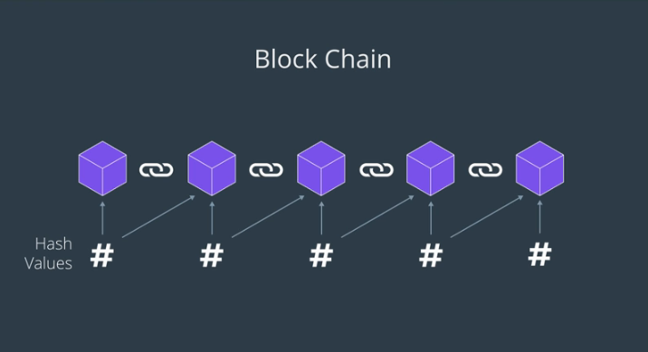
</div>

#### Invalidation 
If data is changed in a block, that block will be invalidated along with any blocks that succeed it and thus breaking the blockchain.

<div align="center">
	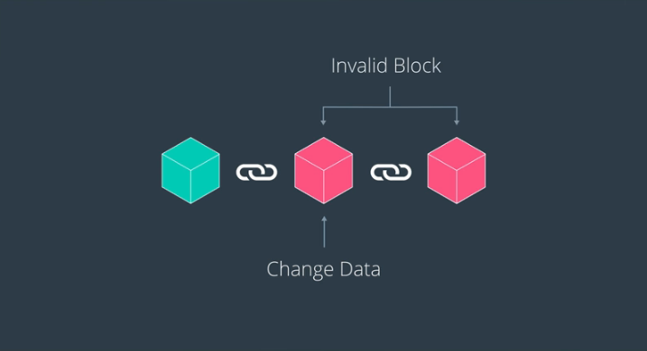
</div>

#### Genesis Block
The first block in the blockchain is called the **genesis block**

<div align="center">
	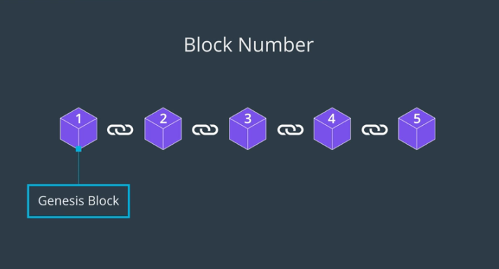
</div>

Tool: [Ander's | Blockchain](https://andersbrownworth.com/blockchain/blockchain)

### Distributed Peer-to-Peer Network

> Peer-to-Peer Network
> A network of computers that allows information to be shared across users

Allows users, known as a nodes, to send information directly among each other without a centralized service.

<div align="center">
	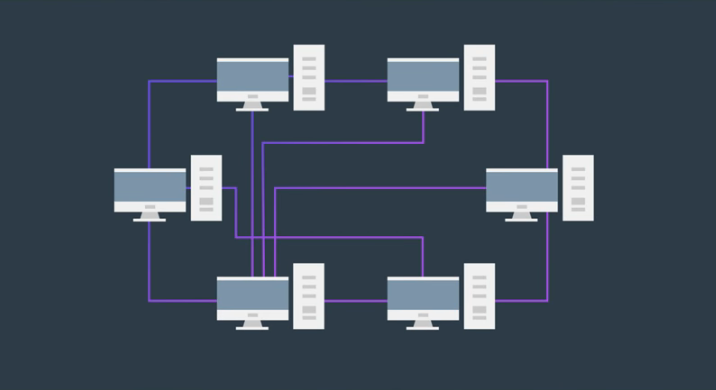
</div>

> Distributed Network
> A network that allows information to spread out across many users

With peer-to-peer allowing users to send information among each other, being distributed also allows the user to own the information as well.

#### Types

<div align="center">
	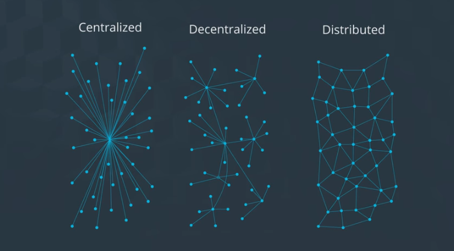
</div>

##### Centralized
Everything connects to a single central owner, which creates a single point of failure as well.

##### Decentralized
Instead of a single point, it is now spread across multiple points.

##### Distributed
Decentalization at the maximum, now every user on the network has the same access and ownership

**Blockchain is a distributed peer-to-peer network where everyone downloads a copy of the blockchain on their computer**

### Memory Pool
This is where transactions reside before going on the blockchain or becoming part of the network, also knows as the **mempool**

As the number of transactions being made exceed what the network can process a queue is created.

> Mempool
> Waiing place for all unconfirmed transactions before they are added to the blockchain

Transactions are not instant, as they need to be confirmed by the network and are done so by specialized nodes in the network called miners. Miners pull from the mempool to validate transactions before they are added to the blockchain to keep consensus.

<div align="center">
	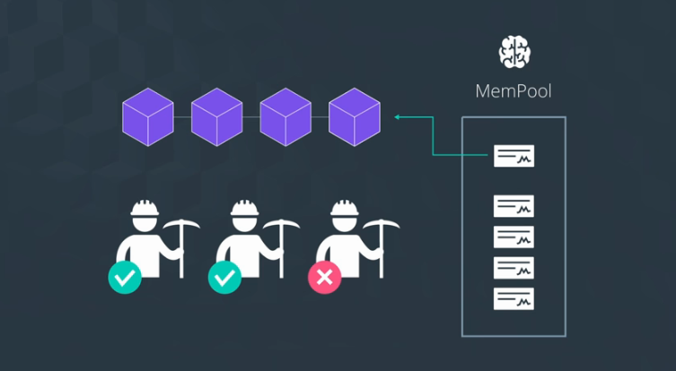
</div>

Transactions in the mempool could be evicted due to:
* expiration by timeout (14 days after entering)
* being at the bottom of the mempool by fee size when capacity is reached and a new higher-fee transaction is accepted
* being added to the block
* the transaction or an unconfirmed acestor conflicts with the transaction included in the block

A transaction confirmation is the number of times another **block** or **transaction** is placed chronologically after your **transaction’s block**.

Added to the block the first time, is equivalent to one confirmation. Another block succesfully added chronoligcally is two confirmations, the next three confirmations and so on. 

A transaction is considered safe after six confirmations.

#### Resources
[Blockchain.com](https://www.blockchain.com/about/index.html)

* [Unconfirmed Transactions](https://blockchain.com/unconfirmed-transactions)
* [Blockchain Data Charts](https://blockchain.com/charts)

[Blockchain Visuals](https://bitcoinvisuals.com/stats)

### Consensus

> Concensus
> How the network reaches agreement about which transactions are most trustworthy

#### Byzantine Generals' Problem
a situation where spread out nodes need to coordinate their behavior or action but cannot trust each other to get organized

Additional Reading: [What is the Byzantine Generals Problem? | CoinCentral](https://coincentral.com/byzantine-generals-problem/)

The following algorithms are three of the many out there

#### Proof of Work

whoever puts in the most work to contribute to the system is the most trustworthy

> Proof of Work
> System where information can be costly to produce, but easy to verify

Each node (miner) is involved in solving a problem to proof they've done required work. 

In response to putting in work via time and resources, each node (miner) is paid transaction fees directly from those making the transactions as well from the technology as a reward for mining the new block.

<div align="center">
	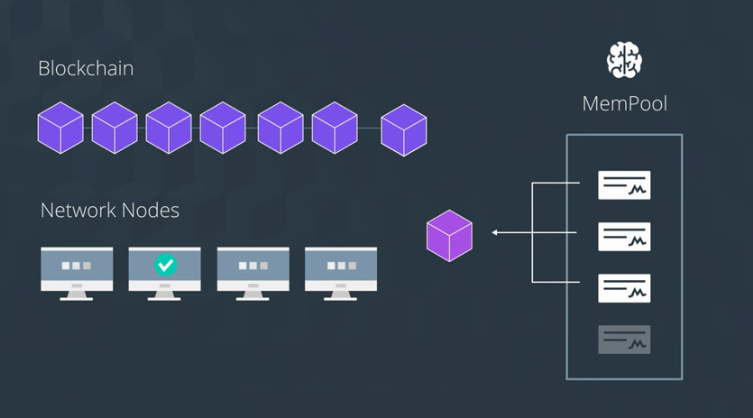
</div>

Miner's purpose is finding the nonce for the new block, which is the key to finding the blocks hash value. 

**Block Data + Nonce = Hash Value**

In Bitcoin, the difficulty is adjusted automatically so that a block is generated every 10 minutes.

<div align="center">
	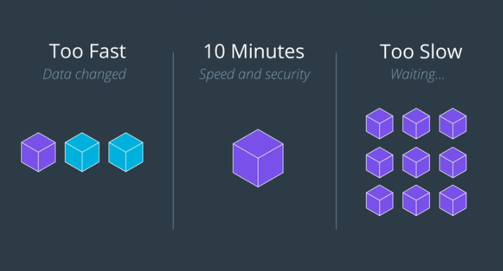
</div>

##### Potential Issues
Extremely High-Energy Consumption

<div align="center">
	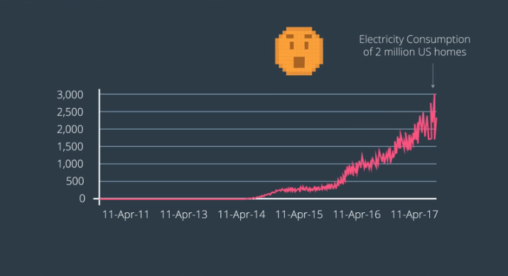
</div>

Monopoly of miners leads to concern for Centralization

Those with resources to acquire more equipment will have an unfair advantage.
Mining pools/farms have helped in leading a monopoly of the miners that control a majority of the network and as they dedicate more nodes to the network they have more say in what blocks are considered valid thus leaning to a more centralized system than distributed.

<div align="center">
	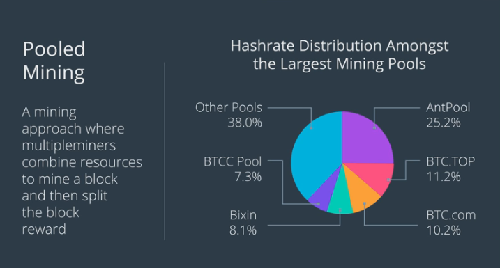
</div>

#### Proof of Stake
Focuses on giving votes to members, depending on how much stake they have in the success of the chain.

> Proof of Stake
> Seeks to achieve consensus by giving votes to those with stake in the system

##### How does it work?
There are no miners, there are validators. Validators do not need to invest in computing equipment to mine the blocks that create coins, all the coins exist from the outset.

Purpose of the validators, known as stakeholders, validate which blocks make it onto the blockchain.

The greater the fraction of the total coins a validator owns, they have a higher chance to be picked to create the next block, as that emphasizes a higher stake.

<div align="center">
	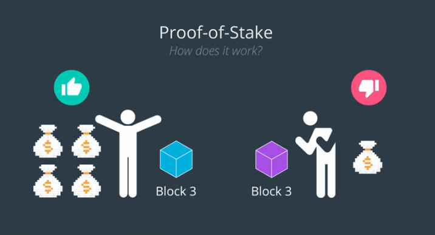
</div>

If a validator's block is added to the blockchain, they are awarded coins proportional to the amount of their stake.

##### Potential Issues
"Nothing at Stake" Problem

Blockchains can fork, accidentally or by a malicious attempt to reverse a transaction. So with these multiple competing block options, couldn't a malicious validator stake into every block so they always profit?

<div align="center">
	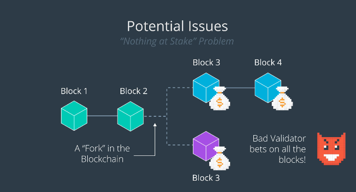
</div>

##### Strategies

It is a possibility, but strategies have been added in place against these types of attacks.

The slasher strategy penalizes validators for simultaneaously creating blocks across multiple chains.

The punisher strategy, well, punishes validators for creating a block on the wrong chain. Validators must be selective and conscious of which blockchain they add their stakes.

##### Resources
[Ethereum's Proof of Stake FAQs](https://eth.wiki/en/concepts/proof-of-stake-faqs)

#### Delegated Byzantine Fault Tolerance (DBFT)
Tries to achieve consensus by assigning roles to nodes to help coordinate consensus.

> Delegated Byzantine Fault Tolerance
> Consensus algorithm based on assigning roles to nodes to help coordinate consensus

##### How does it work?
Does not users miners, instead has nodes that are split into ordinary nodes and concensus nodes.

<div align="center">
	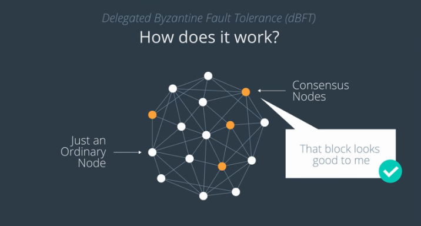
</div>

Majority of nodes, are ordinary nodes, in the network that can transfer or exchange assets but do not participate in validating blocks.

For an ordinary node to a concensus node it requires meeting criteria set by the platform.

Concensus nodes are able to validate blocks on the blockchain, acts as a representative to the other nodes in the network. Keeping track of proposed blocks that can be added to the blockchain and when a new block needs to be added to the chain a concensus node will be randomly chosen from all the concensus nodes in the pool.

In the neo blockhain, the chosen concensus node is referred to as the **speaker** while the rest of the concensus nodes are **delegates**. For the new block to be added to the chain proposed by the speaker, 2/3 of the delegates must approve the new block to be added to the blockchain. If the proposed block is denied, then a new speaker is chosen and the previous speaker becomes a delegate.

<div align="center">
	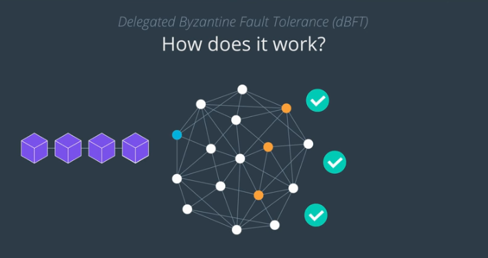
</div>

Supposed to be much faster than proof-of-work and requires much less resources as there are not cryptographic puzzles to solve and is resistant to forking as there is only one version of truth.

##### Issues / Strategies

**Dishonest Speaker**
In this scenario the speaker could be dishonest or malfunction, and in so, relies on the honest delegates to block the proposed block so it doesn't receive the 2/3 approval rate. Since delegates are voted on by the users of the protocol and the speaker is randomly selected from this delegate group, it's up to the users to determine which delegates are trustworthy to vote them into power.

**Dishonest Delegate**
Up to users to do their due diligence to vote honest delegates into power so dishonest ones are in the minority. If a monitory of delegates are dishonest, up to the honest ones to block the proposed block down to not make it into the blockchain. To help with this scenario, some blockchain platforms release data about the honesty and functioning of each delegate for voters to review.

#### Other Consensus Models

**Proof of Work**
[Bitcoin’s whitepaper on PoW](https://bitcoin.org/bitcoin.pdf)

**Proof of Stake**
[Ethereum’s Proof of Stake FAQs](https://eth.wiki/en/concepts/proof-of-stake-faqs)

* [Block Selection methods](https://en.wikipedia.org/wiki/Proof_of_stake)
	- Randomized block selection
	- Coin age-based selection
* [Alternative Proof of Stake Methods](https://dailyfintech.com/2016/01/20/why-proof-of-stake-matters-for-blockchain/#content-wrapper)
	- Transparent Forging
	- Delegated Proof of Stake

**Delegated Byzantine Fault Tolerance**
[NEO's Consensus Protocol](https://steemit.com/neo/@basiccrypto/neo-s-consensus-protocol-how-delegated-byzantine-fault-tolerance-works)

**Proof Of Activity**
[Proof of Activity Explained: A Hybrid Consensus Algorithm](https://www.coinbureau.com/blockchain/proof-of-activity-explained-hybrid-consensus-algorithm/)

**Proof Of Burn**
[What is Proof of Burn?](https://99bitcoins.com/what-is-proof-of-burn/)

## Lesson 2: Managing Blockchain Transactions

### Blockchain Identity
It is your unique identifier to establish yourself in the blockchain world, this is the **wallet address**.

> Wallet Address
> A unique identifier for your wallet

A wallet address cannot be traced due to the way it is created, from a private key > public key > wallet address.

> Private Key
> A secret number that allows you to spend coin from your wallet

Private keys are not to be shared with anyone, so we must derive a public key from the private key.

> Public Key
> Publicly shareable key that cannot be used to spend coin

Public keys can be shared without worry of the security of our private key, but the private key must be linked to that public key.

Bitcoin uses the Elliptic Curve Digital Signature Algorithm (ECDSA) to produce a public key from a private key.

<div align="center">
	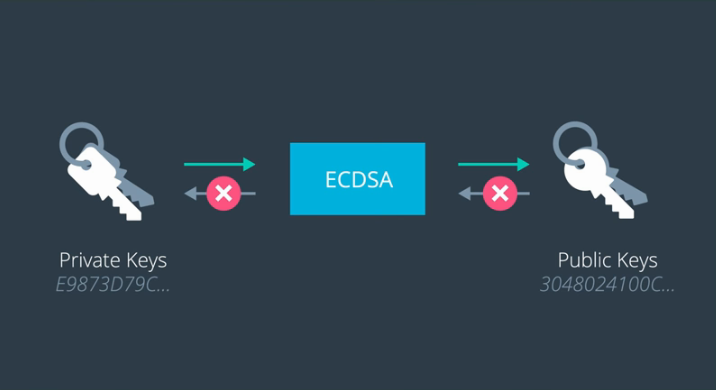
</div>

Now the wallet can use the private and public key to track transactions.

Sadly, even though we can share the public key safely it can still be traced back to the owner, and this is done with a **wallet address**.

> Wallet Address
> A unique identifier for your wallet

A wallet address is created from the public key and in Bitcoins case it goes through two alogrithms, SHA256 and RIPEMD160.

<div align="center">
	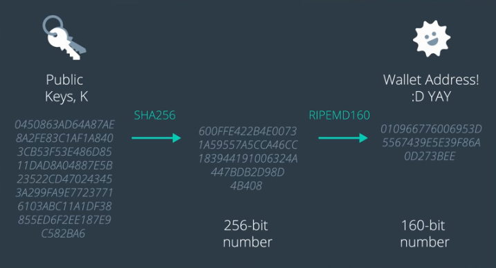
</div>

Now that we have the wallet address we need to do one more thing to it for ease of sharing and useability by removing letters and numbers that look the same by passing it through a Base58Check.

<div align="center">
	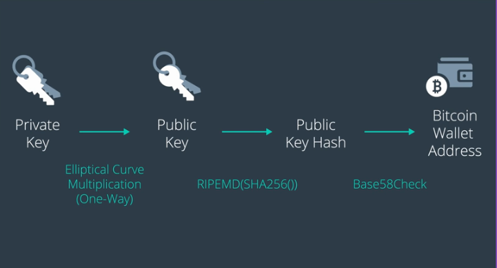
</div>

### Wallet Types

<div align="center">
	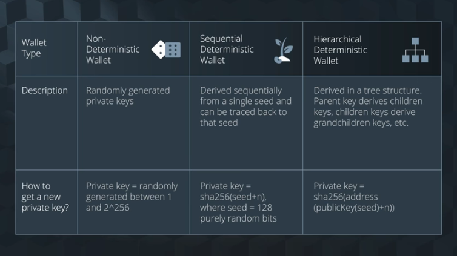
</div>

> Non-deterministic Wallet (Random Wallet)
> A wallet where private keys are generated from random numbers

> Deterministic Wallet
> A wallet where addresses, private keys, and public keys can be traced back to their original seed words

> Hierarchical Deterministic Wallet
> An advanced type of deterministic wallet that contains keys derived in a tree structure

<div align="center">
	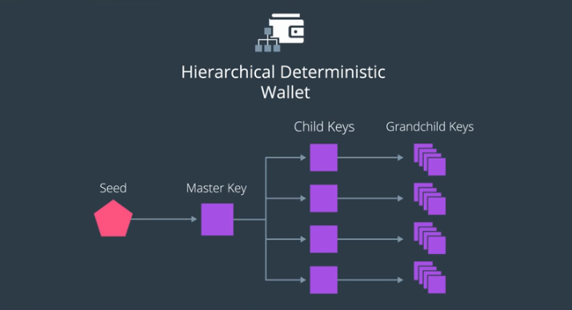
</div>

#### Non-Deterministic Wallet
Buncha random keys generated.

```
Random number -> Private Key -> Public Key -> Wallet Address
```

#### Deterministic Wallet

##### Sequential Determinisic Wallet
Random number is generated to create a seed, which is then passed through a mathermatical function to create a series of private keys.

The seed allows to import/export a wallet and allows for easy migration of the keys between different wallet platforms.

<div align="center">
	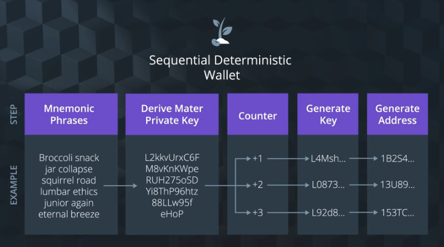
</div>

##### Hietarchical Deterministic Wallet
Fanciest type. Allows to create sub-private and sub-public keys to be able to branch off portions of the wallet and jail access to those areas.

<div align="center">
	
</div>

### Private Keys

> Private Key
> A 256-bit random number between 1 and 2^256.

It can be represented in different formats but they all correspond to the 256-but number.

<div align="center">
	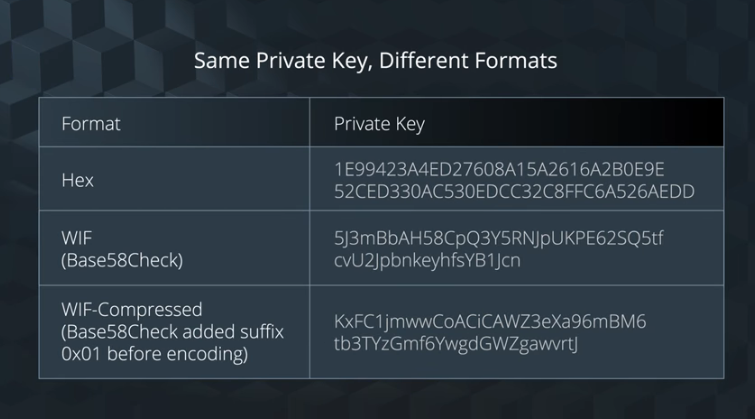
</div>

So how is every private key unique?
The key is generated between 2 and 2^256, that is one large number. In perspective, there is 2^63 (7 quintillion) grains of sand on earth.

To generate a key at simplest terms, you can take a coin and flip it 256 times. For each head write a 1 and 0 for tails, this would be the binary form of a random private key.

> Entropy
> Lack of order or predicatbility. It's the degree of disorder or randomness in the system

### Sign a Transaction

> Signature
> Establishes proof of ownership for each transaction on the blockchain

Transactions start broadcasting to the network when a wallet signs the transaction. 

Ensure's that it is you who's sending the coins by signing it with your identity, which is your wallet address.

Once signed, it goes from the sender to the receiver as a transaction message. Which in Bitcoin, it is broadcasted to the chain as an **unspent transaction output (UTXO)**.

Only UTXO's can be used as input to an accepted transaction, and each of these UTXO's have conditions regarding proof of ownership to transact with the funds which are derived from your private key.

#### Transaction Inputs
Considered inbound payments that contribute to funding your wallet. Each transaction input has a condition, it will need to be converted to an output which contains the condition to prove ownership using your private key.

A wallet must have funds to be able to produce valid transaction outputs.

To craete a transaction output you need to have the sum of the input transactions which are equal to, or, greater than the value you are sending.

<div align="center">
	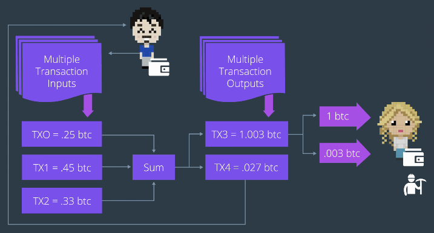
</div>

### Blockchain Transaction Lifecycle

<div align="center">
	<a href="http://www.youtube.com/watch?v=Emrprht-SqY" target="_blank">
		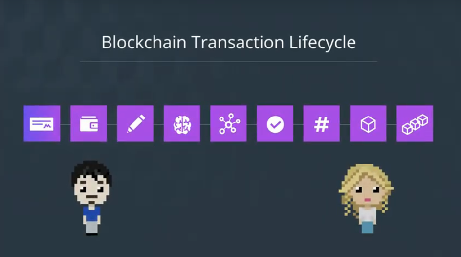
	</a><br />
	<small>(click to view video)</small>
</div>

## Lesson 3 - Bitcoin Core Testnet

### Bitcoin Core Overview

> Bitcoin
> Network of bitcoin users creating and validating transactions

> Bitcoin Core
> Implementation of bitcoin that encompasses all of the software behind bitcoin

<div align="center">
	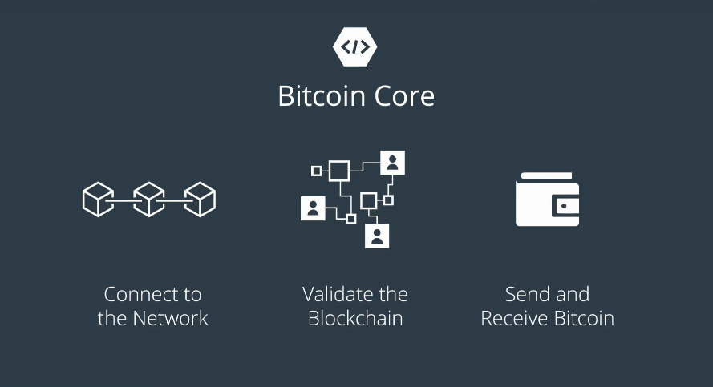
</div>

> Debug Console
> Tool that allows you to interact with data on the bitcoin blockchain

### Bitcoin Core - Networks
There are three networks: Mainnet | Testnet | Regnet

> Bitcoin Mainnet
> Primary network where live transactions take place

> Bitcoin Testnet
> Alternaitve Bitcoin blockchain that provides a test environment for applications

> Bitcoin Regnet (Regression Test Mode)
> Alternative test network for testing bitcoin applications

<div align="center">
	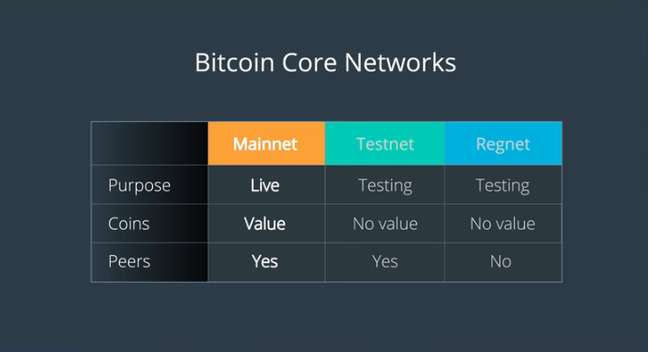
</div>

### Mainnet vs Testnet

Block creation stays the same, every 10 minutes since both of these networks rely on nodes for block creation.

People have hoarded Testnet coins and have tried to sell them. This creates a shortage and makes it harder to test applications, so developers have wiped the coins to start anew. So far this has happened twice to we are on the third iteration of Testnet.

<div align="center">
	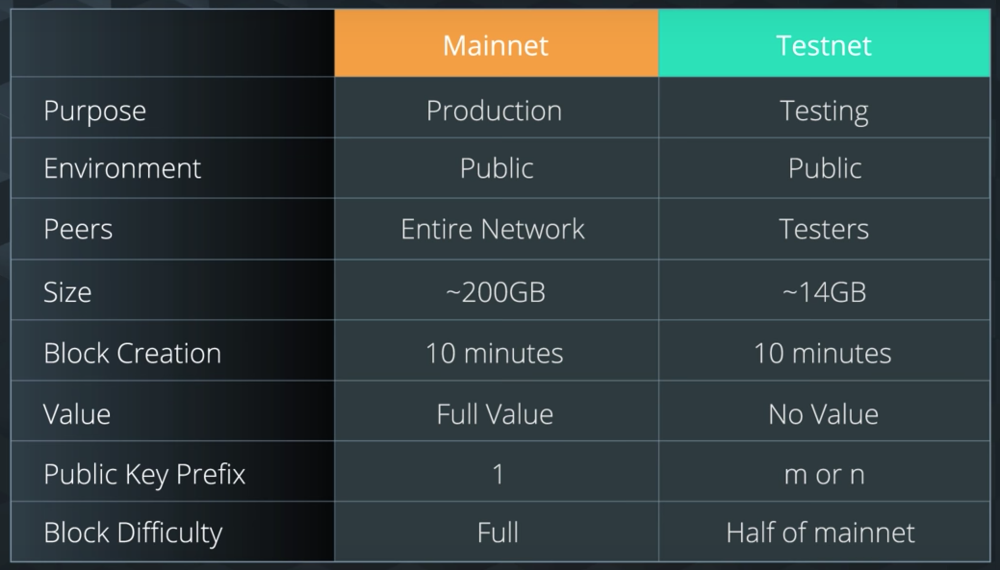
</div>

#### Resources
[Bitcoin Wiki Testnet](https://en.bitcoinwiki.org/wiki/Testnet)
[Developer Test Application Examples](https://bitcoin.org/en/developer-examples#testing-applications)

### Testnet vs Regression Testing

<div align="center">
	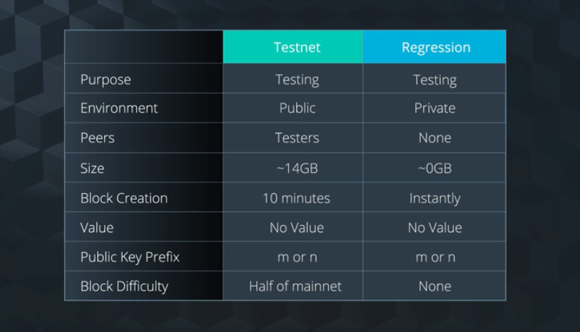
</div>

## Lesson 4 - Blockchain Data

### Blockchain Data Models Overview

**Block Header**

* **Previous Block’s Hash**: The hash value for the block that comes directly before a given block in the chain. This is what links blocks in the blockchain together
* **Time**: The time the block was created is also held in the header
* **Merkle Root**: The merkle root is a hash that represents every transaction included inside the block. To get the merkle root, pairs of transactions within a block are repeatedly hashed together. Each pair results in a single hash. Then the hash of 2 pairs of transactions are again hashed together, over and over again until you are left with a single hash value. Given that final hash value, known as the merkle root, you can now use the hash to search the original transactions or hash values that created them. This searching allows you to find the original transactions that made up the block when starting from this single hash value.
* **Nonce**: A nonce (stands for “number only used once") is a number used in bitcoin mining. The blockchain miners are solving for the nonce that when added to a hashed block, and those 2 values are rehashed, will solve the mining puzzle.

**Block Body**
* Transactions
    * Inputs
    * Outputs

<div align="center">
	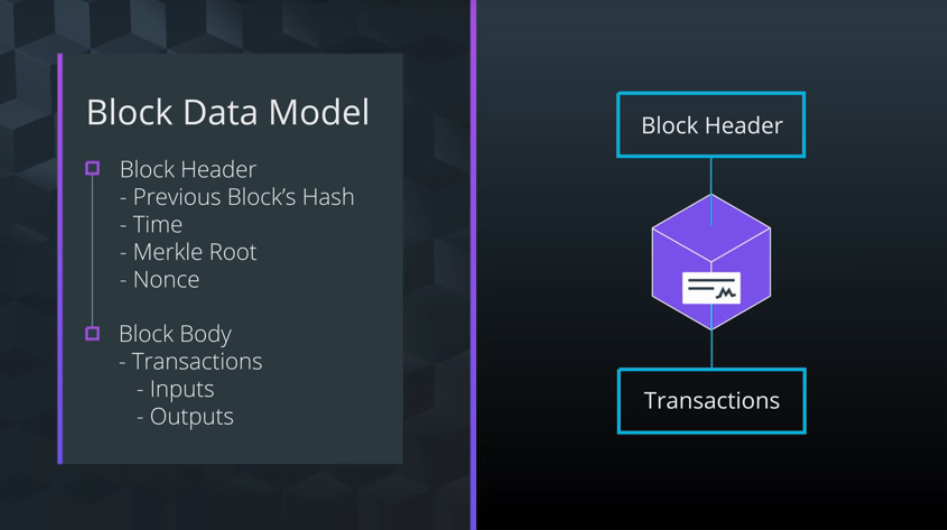
</div>

### Transactions - Inputs and Outputs

Transactions are the fundamentals of which blocks of data are built from, they are the data structure that encodes a transfer of value from a source of funds called an "input" to a destination called an "output".

Inputs in one transaction are unspect outputs from another transaction. All inputs reference back to an output, unspent outputs is short-handed to UTXO.

> Transaction
> A data structure that encodes a transfer of value from a source of funds called an "input" to a destination called an "output"

There is no such thing as a stored balance for an account, it's UTXO records on the blockchain tied to a specific owner.

You send Jessica 2 BTC. The wallet then scans the blockchain to find UTXO and gathers the sum of them. In this instance finds two of them, one fot 1.25 BTC and another for 1.75 BTC for a total of 3 BTC for the input of the transaction. An input is created for Transaction A and another for Transaction B, from there two outputs are created.  One is the UTXO for 2.0 BTC we sent to Jessican and the other UTXO is our change of 1.0 BTC.

<div align="center">
	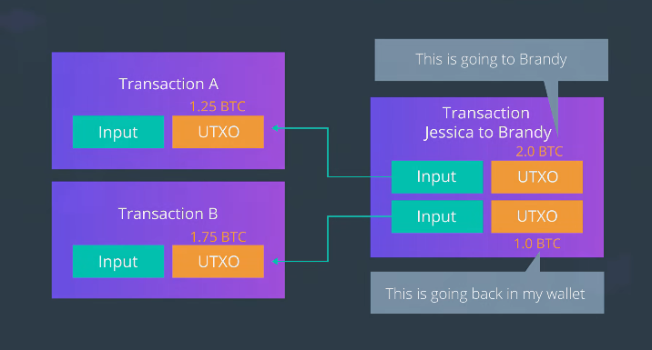
</div>

If there is a minors; transaction fee, it's the difference between the inputs minus the outputs.

**Sum(Inputs) - Sum(Outputs) = Transaction Fees**

### Transaction Data Models

On the blockchain, transactions are stored in a double hash form; the raw transaction is passed through SHA256, twice.

<div align="center">
	
</div>

<div align="center">
	<p>Animation showcasing the different parts to the transaction data model</p>
	<a href="./assets/transaction_data_model.mp4"  target="_blank">
		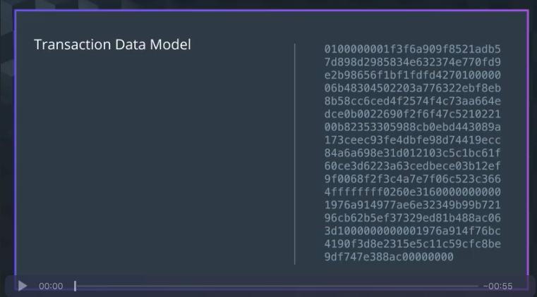
	</a>
	<p><small>(click to view)</small></p>
</div>


Part of what is contained in the Input and Output info are scripts on how a transaction was signed.

The input info contains the unlocking script while the output info contains the locking script. If the transaction is valid, the unlocking script will have the requirements that unlocks the unlocking script.

Review of what the block contains

<div align="center">
	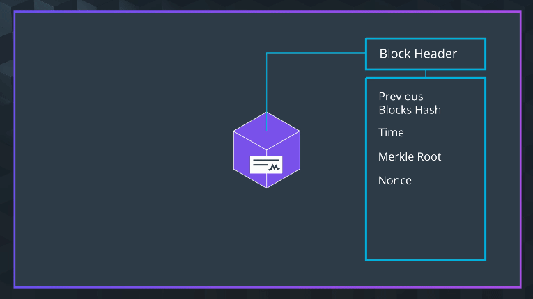
</div>

### Bitcoin Scripts

> Script
> A list of instructions recorded in each transaction that when executed determines if the transaction is valid and the bitcoins can be spent

Bitcoin scripting language is called, Script.

<div align="center">
	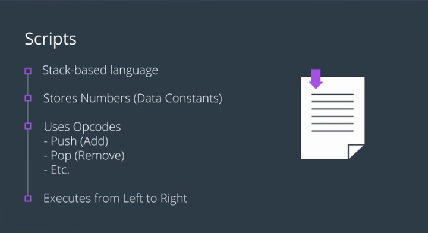
</div>

Unlocking and Locking Scripts
* What are their purposes?
* How do they work?
* Where to find them?

**Inputs contain unlocking script**
**Outputs contain locking scripts*

The scripts are small programs in each transaction that execute to determine if the transaction is valid. If valid, the transaction is signed.

The unlocking script contains the "puzzle" piece to solve the locking script to evaluate it to true and allow the output to be spent.

The unlocking script of the input interacts with the locking script of an output from a previous transaction. 

A locking script places a lock on the output, specifying the conditions that must be met in order to spend the outputs in the future.

Unlocking script cant be found under `scriptSig` while the locking script can be found under `scriptPubKey` in the raw transaction below:

<div align="center">
	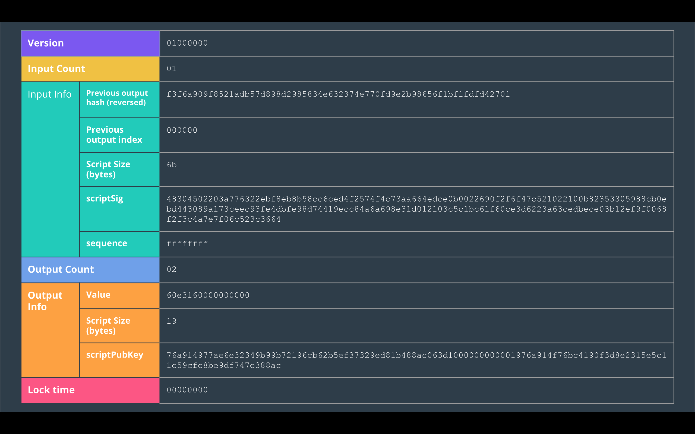
</div>

-   **Version** - All transactions include information about the Bitcoin Version number so we know which rules this transaction follows.
-   **Input Count** - Which is how many inputs were used for this transaction

**Data stored in Input information:**

-   **Previous output hash** - All inputs reference back to an output (UTXO). This points back to the transaction containing the  UTXO that will be spent in this input. The hash value of this UTXO is  saved in a reverse order here.
-   **Previous output index** - The transaction may have more than one UTXO which are referenced by their index number. The first index is 0.
-   **Unlocking Script Size** - This is the size of the Unlocking Script in bytes. 
-   **Unlocking Script** - This is the hash of the Unlocking Script that fulfills the conditions of the UTXO Locking Script. 
-   **Sequence Number** - This is a deprecated feature of bitcoin, currently set to `ffffffff` by default. 

**Output Count** - which tells us how many outputs were produced from this transaction.

**Data stored in Output Information:**

-   **Amount** - The amount of Bitcoin outputted in Satoshis (the smallest bitcoin unit). 10^8 Satoshis = 1 Bitcoin.
-   **Locking Script Size** - This is the size of the Locking Script in bytes. 
-   **Locking Script**  - This is the hash of the Locking Script that specifies the conditions that must be met to spend this output. 

**Locktime** - The locktime field indicates the earliest time or the earliest block a  transaction can be added to the  blockchain. If the locktime is non-zero  and less than 500 million, it is  interpreted as a block height and miners have to wait until that block  height is reached before attempting to add it to a block. If the  locktime is above 500 million, it is read as a UNIX timestamp which  means the number of seconds since the date  January 1st 1970.  It is  usually 0 which means confirm as soon as possible. 

### Script Opcodes

Script is a stack based language, read left to right, and opcodes allow us to interact with data on the stack. It can push (add) or pop (remove) items from the stack among many other things. Opcodes are prefix by `OP_`.

<div align="center">
	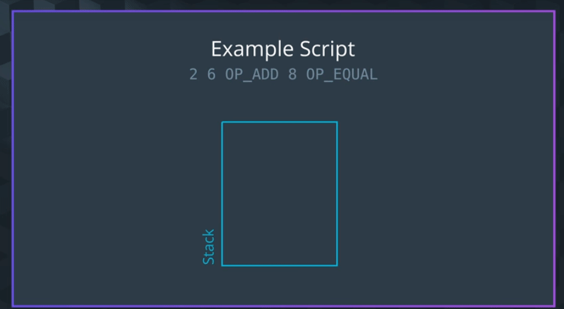
</div>

#### Resources
[List of Bitcoin opcodes](https://en.bitcoin.it/wiki/Script)

### Attributes of Script

**Not Turing Complete**

* No loops or complex flow control, other than conditional flow control
* Completely deterministic
* Provides simplicity and security

**Stateless Verification**
* No state saved prior to or after the script executes
* Scripts is self-contained
* Provides predicatability no matter where script is executed