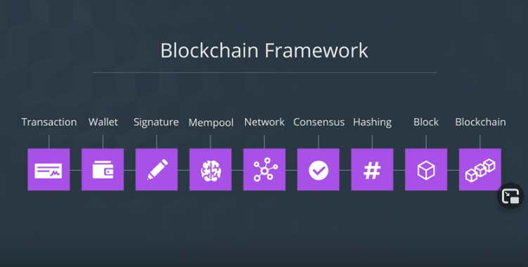

> Blockchain Developer
> Udacity Nanodegree

# Blockchain Developer Nanodegree

> Blockchain
> Shared database that contains a list of transactions

> Hash
> A unique fingerprint for information

## Blockchain Framework

## Financial Transactions

### Current State of Financial Transactions

Trading, by giving value to something, but makes it difficult to agree on its value.

Find something with intrinsic value like gold, where the value of an item can be agreed upon to how much gold it's worth. This could be further evolved by creating a currency like money in place of the gold.

Banks manage the transactions we are making with our money. These establishments are known as a **trusted 3rd party**.

> Trusted 3rd Party
> Entity that facilitates interactions between two parties

These establishments help in securely storing our money and managing our transactions. Many systems are in place to make this happen but a key one is a **ledger**

> Ledger
> List of transaction records

Keeping track of who paid whom and who has what, to help prevent **double spending**

> Double Spending
> When comeone spends the same money more than once

### Problems

Banks having our transaction data is crucial, but is it ideal to have that much control of the data?

Let's remove the bank ledger and implement a shared ledger where everyone has access and have complete control over their own data.

---

Delayed transaction times and fees when transferring money through different services that need to communicate with the banks.

Blockchain could solve all this, but it's all a **WORK IN PROGRESS**

## Introduction to Bitcoin

### What is Bitcoin?

Blockchain started with the first implementation of a new currency; **Bitcoin**

> Bitcoin
> A digital currency that utilizes the blockchain to facilitate financial transactions

Uses the idea of **blocks** to store and validate transactions.

> Block
> Groups of transactions bundled together

Bitcoin was not the first to group, validate and link documents. Starts around 1991, when Haber and Stornetta released their research paper [How to Time-Stamp a Digital Document](https://www.anf.es/pdf/Haber_Stornetta.pdf)

The research proposed to timestamp a document and linking it to the previous document to create a chain of validated documents.

In 2008, Satoshi Nakamoto, published a **whitepaper** detailing the foundation of Bitcoin; [Bitcoin: A Peer-to-Peer Electronic Cash System](https://bitcoin.org/bitcoin.pdf).

> Whitepaper
> A guide that informs readers concisely about a complex issue and presents understanding on an issue, solving problem or making a decision

January 3, 2009: Nakamoto released the Bitcoin software.

After Bitcoin came about was the realization of the potential in the blockchain.1

## Hashing

> Hash Value
> A digital fingerprint for information

A unique string of letters and numbers that represent a set of data, which can be generated through a **hashing function**

> Hashing Function
> Maps a group of data to a unique hash value

Hash value acts as a unique identifier for the original data. Allows to easily identify data by referencing its hash value.

A unique value is given to each block on the blockchain to create a unique identifier for each block that exists in the chain.

Allows to reference a block by its hash value and create the foundation in how blocks are chained.

Tool: [Ander's | SHA256 Hash](https://andersbrownworth.com/blockchain/hash)
Exercise: [Practice Hashing](./exercises/hashing)

## Blocks

Fundamental componenets of the blockchain.

> Block
> A container that holds a list of transactions to be added to the blockchain

> Blockhain
> Shared digital ledger that records a list of transactions

### Transactions

Without the blocks, which compartmentalize the transactions, it would create a massive list of transactions that would be difficult to work with or manage.

<figure>

<figcaption align="center">Transaction list without blocks</figcaption>
</figure>

<figure>

<figcaption align="center">Transaction list separated into blocks</figcaption>
</figure>

With the transactions broken out into blocks, it makes it easier to manage, with transactions held in the *body of a block*

### Block Header

Additional information is stored in the block as well, this is at the _block header_ which details the structure of the data within

#### Previous Block's Hash
hash of the block before the current one. Allows the blocks to be linked together by knowing what came before / after

---

#### Time
when the block was created, which helps in avoidining double-spending and validates which block came first

---

#### Merkle Root
hash that represents every transaction inside the block, which is derived from pairs of the transactions insde the block repeatedly hashed together.

Each pair results in a hash which is hashed repeatedly until a single hash value is generated.

---

#### Nonce
related more towards mining. An arbitrary value that can only be used once. 

When a hash is created for a block, a very specific value is required that starts with a set number of zeros that determines the hash's difficulty to find.

Requiring all the block data and the nonce to get the hash value, which the computer does over and over until the appropriate hash is found.

---

### Block Difficulty

A block's difficulty is determined by the amound of zeros prepended to the hash More zeros increases the diffilculty while less does the reverse.

### Block Size

This is the amount of data it takes to the block fill up before a new one needs to be created. Block size affects all the blocks in the blockchain and is determined by the developer, thus requiring an update to the software to change the block size value.

### Block Hash

A unique digital fingerprint that is derived from the block's data being passed through a SHA256 algorithm. If any of the data changes within the block, a new hash would be derived, allowing to determine if the block's data was tampered.

Tool: [Ander's | Block](https://andersbrownworth.com/blockchain/block)
Exercise: [Practice Block](./exercises/block)

