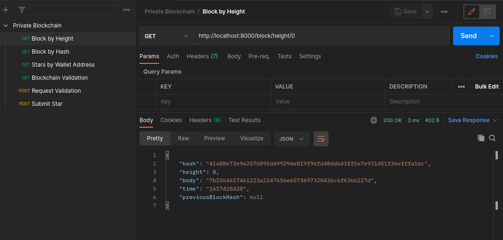

<h2>Project Specification</h2>
<h3>Create Your Own Private Blockchain</h3>

**Complete unfinished block.js implementation**

| Criteria                                                     | Meets Specifications                                         |
| ------------------------------------------------------------ | ------------------------------------------------------------ |
| Modify the `validate()` function to validate if the block has been tampered or not. | - Return a new promise to allow the method be called asynchronous. - Create an auxiliary variable and store the current hash of the block in it (this represent the block object) - Recalculate the hash of the entire block (Use SHA256 from crypto-js library) - Compare if the auxiliary hash value is different from the calculated one. - Resolve true or false depending if it is valid or not. |
| Modify the `getBData()` function to return the block body (decoding the data) | - Use hex2ascii module to decode the data - Because data is a javascript object use JSON.parse(string) to get the Javascript Object  **Resolve with the data and make sure that you don't need to return the data for the genesis block OR reject with an error.** |

**Complete unfinished blockchain.js implementation**

| Criteria                                                     | Meets Specifications                                         |
| ------------------------------------------------------------ | ------------------------------------------------------------ |
| Modify the `_addBlock(block)` function to store a block in the chain | - Must return a Promise that will resolve with the block added OR reject if an error happen during the execution. - height must be checked to assign the previousBlockHash     - Assign the timestamp & the correct height     - Create the block hash and push the block into the chain array.     Don't for get to update the `this.height` |
| Modify `requestMessageOwnershipVerification(address)` to allow you to request a message that you will use to sign it with your Bitcoin Wallet (Electrum or Bitcoin Core) | - must return a Promise that will resolve with the message to be signed |
| Modify `submitStar(address, message, signature, star)'`function to register a new Block with the star object into the chain | - must resolve with the Block added or reject with an error. - time elapsed between when the message was sent and the current time must be less that 5 minutes - must verify the message with wallet address and signature: bitcoinMessage.verify(message, address, signature) - must create the block and add it to the chain if verification is valid |
| Modify the `getBlockHeight(hash)` function to retrieve a Block based on the hash parameter | - must return a Promise that will resolve with the Block     |
| Modify the `getStarsByWalletAddress (address)` function to return an array of Stars from an owners collection | - must return a Promise that will resolve with an array of the owner address' Stars from the chain |
| Modify the `validateChain()` function                        | - must return a Promise that will resolve with the list of errors when validating the chain - must validate each block using validateBlock() - Each Block should check with the previousBlockHash - execute the `validateChain()` function every time a block is added - create an endpoint that will trigger the execution of `validateChain()` |

**Test your App functionality**

| Criteria                                                     | Meets Specifications                                         |
| ------------------------------------------------------------ | ------------------------------------------------------------ |
| Use **POSTMAN** or similar service to test your blockchains endpoints and send screenshots of each call | - must use a GET call to request the Genesis block - must use a POST call to `requestValidation` - must sign message with your wallet - must submit your Star - must use GET call to retrieve starts owned by a particular address |

---

<h3>Screenshots</h3>

